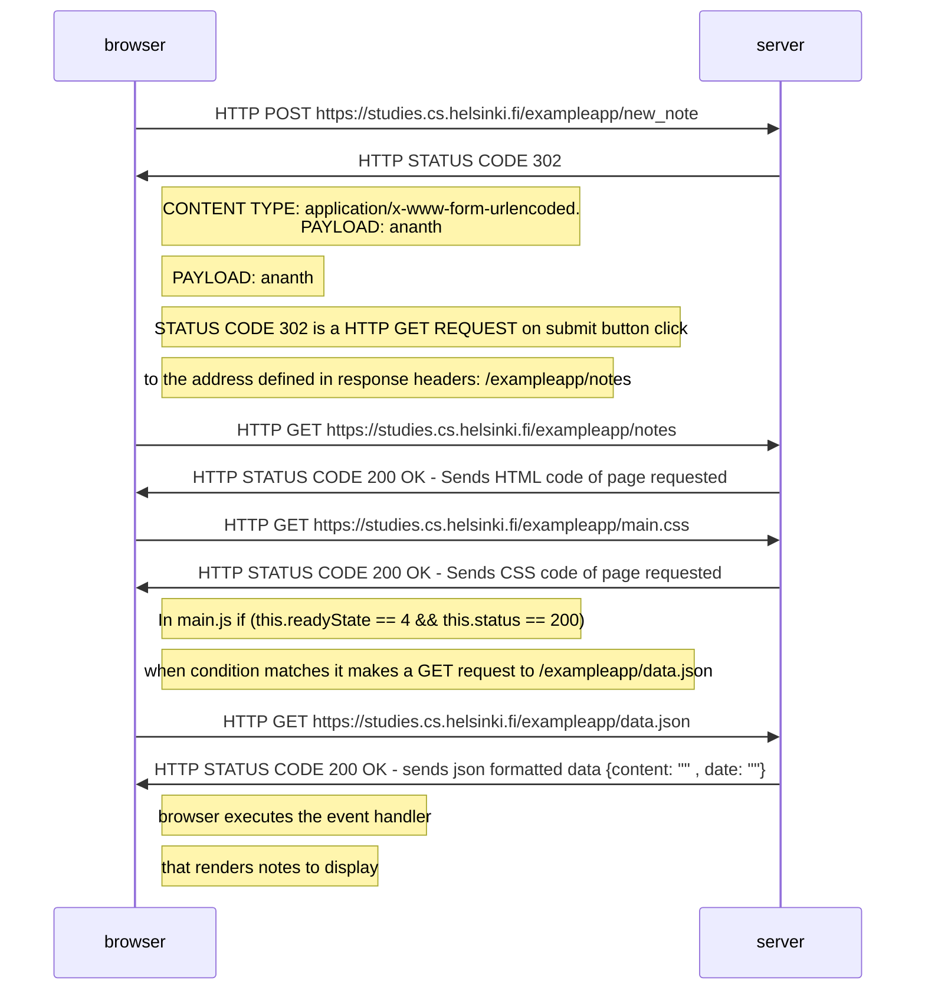

 **Full Stack Open 2023 - Part 0**
 
 #### 0.1: HTML
Review the basics of HTML by reading this tutorial from Mozilla:  [HTML tutorial](https://developer.mozilla.org/en-US/docs/Learn/Getting_started_with_the_web/HTML_basics).
_This exercise is not submitted to GitHub, it's enough to just read the tutorial_

#### 0.2: CSS
Review the basics of CSS by reading this tutorial from Mozilla:  [CSS tutorial](https://developer.mozilla.org/en-US/docs/Learn/Getting_started_with_the_web/CSS_basics).
_This exercise is not submitted to GitHub, it's enough to just read the tutorial_

#### 0.3: HTML forms
Learn about the basics of HTML forms by reading Mozilla's tutorial  [Your first form](https://developer.mozilla.org/en-US/docs/Learn/HTML/Forms/Your_first_HTML_form).
_This exercise is not submitted to GitHub, it's enough to just read the tutorial_

#### 0.4: New note diagram
In the section  [Loading a page containing JavaScript - review](https://fullstackopen.com/en/part0/fundamentals_of_web_apps#loading-a-page-containing-java-script-review), the chain of events caused by opening the page  [https://studies.cs.helsinki.fi/exampleapp/notes](https://studies.cs.helsinki.fi/exampleapp/notes)  is depicted as a  [sequence diagram](https://www.geeksforgeeks.org/unified-modeling-language-uml-sequence-diagrams/)

My Solution 
